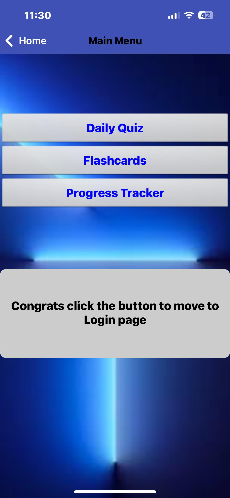

# MIT App Inventor Project

# Varunkanth-Word_wiz-app

<!-- PROJECT LOGO -->

    
  </a>
  <h3 align="center">Word_Wiz App</h3>
  

    A Word_Wiz MIT App
  

<!-- ABOUT THE PROJECT -->

## About The Project

Word_Wiz MIT App is a user-friendly app designed to help beginner and intermediate language learners expand their vocabulary through engaging daily challenges. Built using MIT App Inventor, this app offers an interactive and effective way to learn new words, test knowledge, and track progress over time.

### Main Screens of the app

1. Login Page - (Screen1)
2. Welcome page - (MainMenu)
3. Dail_Quiz 
4. Flashcard
5. Progress Tracker

### Main components using in the app

1. Storage/Tiny DB - Local storage.
2. TextTOSpeech - component allows your app to convert text into spoken words.

## Login Screen

1. Given Username and Password:

* Username: "Admin"
* Password: "1234"

## Welcome Screen (MainMenu)

1. A back button labeled "Home" and a "Main Menu" title, indicating this is a submenu.
2. Three main buttons for core app features.
3. A message guiding the user to the login page, which could be clearer and more user-friendly.
4. A modern and clean aesthetic with a dark blue gradient and white buttons.

