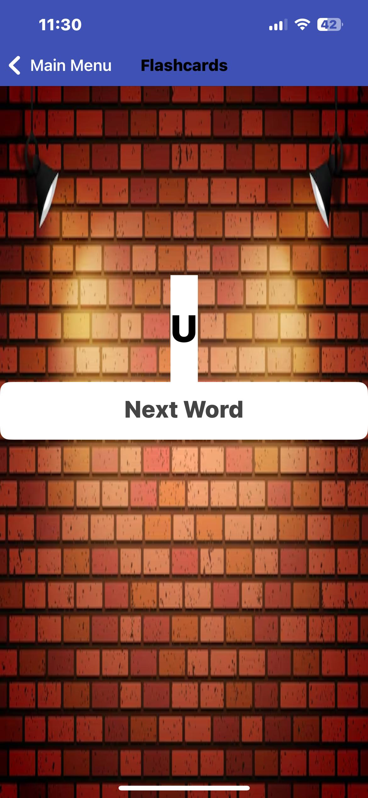

# MIT App Inventor Project

# Varunkanth-Word_wiz-app

<!-- PROJECT LOGO -->

    
  </a>
  <h3 align="center">Word_Wiz App</h3>
  

    A Word_Wiz MIT App
  

<!-- ABOUT THE PROJECT -->

## About The Project

Word_Wiz MIT App is a user-friendly app designed to help beginner and intermediate language learners expand their vocabulary through engaging daily challenges. Built using MIT App Inventor, this app offers an interactive and effective way to learn new words, test knowledge, and track progress over time.

### Main Screens of the app

1. Login Page - (Screen1)
2. Welcome page - (MainMenu)
3. Dail_Quiz 
4. Flashcard
5. Progress Tracker

### Main components using in the app

1. Storage/Tiny DB - Local storage.
2. TextTOSpeech - component allows your app to convert text into spoken words.

## Login Screen

1. Given Username and Password:

* Username: "Admin"
* Password: "1234"

## Welcome Screen (MainMenu)

1. A back button labeled "Home" and a "Main Menu" title, indicating this is a submenu.
2. Three main buttons for core app features.
3. A message guiding the user to the login page, which could be clearer and more user-friendly.
4. A modern and clean aesthetic with a dark blue gradient and white buttons.

## Quiz Screen

* Click on the any option button to display to start the Quiz.
* Select the given option for the MCQ question and it will display if the chosen answer is "correct" or "Try Again".

## Flashcard screen

1. Click the "Next word" button for the "Text-to-speech" component to activate.
2. You can hear the pronounce in Country "IND".
3. The Language option is in default, had tried to change the language to "Tamil" option was unable to select and choose.
    * The language has a default option like : "de"
                                               "en"
                                               "es"
                                               "fr"
                                               "it"   
4. The pitch rate and Speech rate is same which is "1.0".                                               

## ProgressTracker

1. The progress tracker screen has the score achieved by the user.
    (not as excepted)
2. the progress tracker screen has the tinyDB function to store the value of score achieved by the user.

